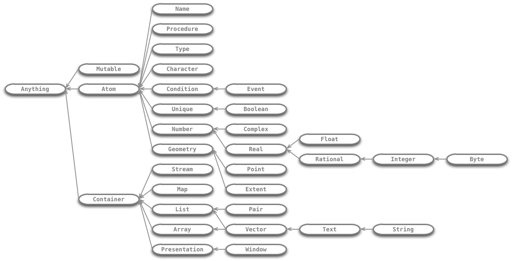

# bard  reference
version 0.4

A reference for Alpaca's built-in Lisp

## Syntax

Bard's special forms, reserved words, and lexical syntax

| Name  | Description |  
| ----  | ----------- |  
| `^`   | Construct a method |
| `->`  | Construct a function |
| `""`  | Construct a string
| `[ ]` | Construct an immutable list
| `{ }` | Construct an immutable map
| `#<typename>` | Require Bard to return an object of the named type from the next expression
| `begin` | Evaluate a sequence of forms in order
| `case` | Evaluate a form whose tag matches a constant value
| `catch` | Catch a tagged nonlocal transfer of control
| `cond` | Evaluate one of several clauses, depending on the results of boolean tests
| `define` | Establish a toplevel variable definition
| `ensure` | Guarantee that a form will be evaluated, even if preceding forms exit abnormally
| `eval` | Evaluate an expression
| `if` | Choose which of two expressions to evaluate
| `let` | Establish local variable definitions
| `loop` | Repeatedly evaluate some expressions, rebinding local variables each time
| `match` | Use pattern matching to establish local variable definitions
| `receive` | Receive messages sent by remote actors
| `repeat` | Repeatedly evaluate some expressions
| `send` | Send messages to remote actors
| `set!` | Assign a new value to a variable
| `signal` | Cause a nonlocal transfer of control, tagging the transfer with a specified condition
| `throw` | Cause a nonlocal transfer of control to a matching `catch` expression
| `unless` |  Test whether to evaluate some expressions
| `when` |  Test whether to evaluate some expressions
| `with-exit` | Locally define an exit procedure
| `with-handlers` | Locally define handlers for signaled conditions
| `with-open` | Locally define an open stream, ensuring that it will be closed on exit

## Named literals

| Name | Description |  
| ---- | ----------- |  
| `true` | the Boolean true value |
| `false` | the Boolean false value |
| `nothing` | an empty collection |
| `end` | the end of a stream |
| `undefined` | no useful value |

## Classes

Bard's abstract types

| Name | Description |  
| ---- | ----------- |  
|`Anything`         | All values
|`Array`        | Containers of objects arranged in rows and columns
|`Atom`           | Objects that are not collections
|`Boolean`    | true and false
|`Byte`   | 8-bit computer words
|`Character`    | Individual text characters
|`Complex`    | Numbers with imaginary parts
|`Condition`    | Objects that represent significant things that happen while a program runs
|`Container`     | Objects that contain groups of other objects
|`Event`      | Conditions that represent things users can do, such as clicking a mouse button
|`Extent`      | Representations of geometric areas
|`Float`    | Inexact decimalß numbers
|`Geometry`  | Representations of geometric objects
|`Integer`  | Whole numbers
|`List`         | Ordered, countable collections
|`Map `          | Containers of key/value pairs
|`Mutable`         | Objects whose contents can be modified
|`Name`         | Objects used to name other objects
|`Number`       | Mathematical values
|`Pair`       | Lists with two elements, a left one and a right one
|`Point`       | Representations of geometric points
|`Presentation`    | Representations of things that can be drawn or otherwise presented to users
|`Procedure`    | Objects that can be executed to perform computations
|`Rational` | Exact ratios
|`Real`       | Numbers without imaginary parts
|`Stream`         | Objects you can read from or write to
|`String`   | Vectors of text characters
|`Text`   | Editable texts used in Alpaca documents
|`Type`         | Objects that represent the types of other objects, like List and Text
|`Unique`       | Objects that are unique, like the named literals
|`Vector`     | Arrays with only rows (Vectors are also Lists)
|`Window`     | Representations of GUI windows

## Structures

Bard's concrete types

| Name | Description |  
| ---- | ----------- |  
|character          | Individual text characters
|class              | Abstract types
|complex-number     | Numbers with imaginary parts
|cons               | Mutable pairs
|document-window    | Windows that present document contents
|float              | Floating-point decimal numbers
|function           | Polymorphic procedures
|hash-table         | Mutable hash tables
|integer            | Whole numbers
|method             | Monomorphic procedures
|ratio              | Ratios of whole numbers
|rectangular-extent | Dimensions (width and height) of rectangular areas
|rectangular-point  | Coordinates (x and y) of points in a Cartesian plane
|string             | Simple text strings
|symbol             | Objects used to name parts of programs
|text               | Text designed to be edited
|treelist           | Immutable ordered, countable sequences
|treemap            | Immutable collections of key/value pairs
|uri                | Objects used to identify files and other resources

## Protocols

Bard's built-in functions, methods, and variables, organized by protocol

### Characters
`alphanumeric?`
#### Functions
#### Methods
#### Macros
#### Variables

### Construction
#### Functions
`make`
#### Methods
#### Macros
#### Variables

### Conversions
#### Functions
`as`
#### Methods
#### Macros
#### Variables

### Functions
#### Functions
`complement`
#### Methods
#### Macros
#### Variables

### Geometry
#### Functions
`extent-height`  
`extent-width`  
`point-x`  
`point-y`  

#### Methods
#### Macros
#### Variables

### Lists
#### Functions
`add-first`  
`add-last`  
`any`  
`append`  
`apportion`  
`by`  
`count-if`  
`dispose`  
`drop`  
`drop-while`  
`element`  
`empty?`  
`filter`  
`find-if`  
`first`  
`head`  
`image`  
`indexes`  
`interleave`  
`interpose`  
`last`  
`leave`  
`length`  
`list?`  
`mismatch`  
`partition`  
`penult`  
`position-if`  
`prefix-match?`  
`reduce`  
`remove-if`  
`remove-duplicates`  
`rest`  
`reverse`  
`search`  
`second`  
`select`  
`shuffle`  
`some?`  
`sort`  
`split`  
`sublist`  
`substitute-if`  
`suffix-match?`  
`tail`  
`tails`  
`take`  
`take-by`  
`take-while`  
`zip`

#### Methods
#### Macros
#### Variables

### Math
#### Functions
`+`  
`-`  
`*`  
`/`  
`<`  
`<+`  
`>`  
`>=`  
`even?`  
`odd?`  

#### Methods
#### Macros
#### Variables

### Pairs
#### Functions
`left`  
`pair?`  
`put-left`  
`put-right`  
`right`  
`set-left!`  
`set-right!`  

#### Methods
#### Macros
#### Variables

### Types
#### Functions
`type-of`  

#### Methods
#### Macros
#### Variables
